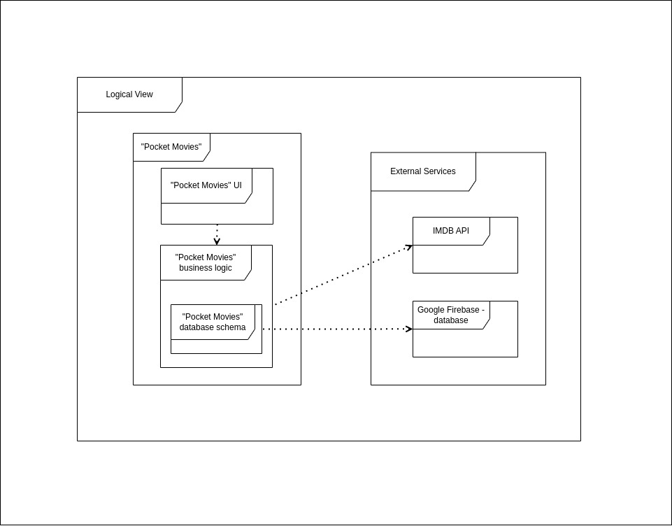
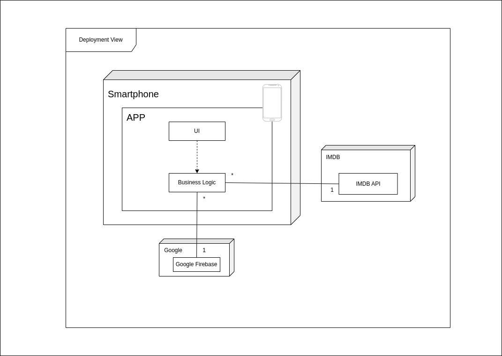

# Architecture and Design

## Logical Architecture

This project is based on an <b>MVC</b> architectural pattern. The user communicates with the pocket cinema UI which in turn will get all its data through the database logic. Finally, the database logic is in charge of getting all the needed information from the <b>IMDB API</b> or the <b>Google Firebase</b> database.  

  

  
  

## Physical Architecture

As described in the previous section, this mobile application is based on an <b>MVC</b> architectural pattern. Each user, through its device, has a UI that presents multiple functions related to movies, such as commenting on movies and making lists. The application has a logic implemented for each of these actions. Some actions will have to get or store information, therefore this logic can communicate with the external sources <b>Google Firebase</b> and <b>IMDB API</b>.

  

