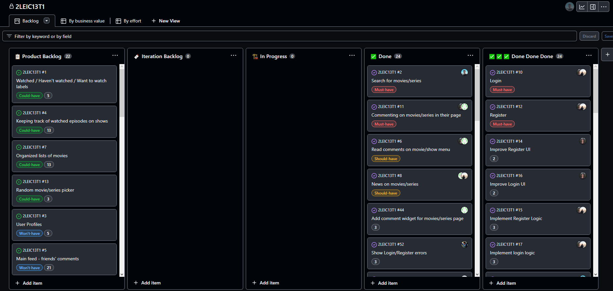

## Project management

All the management of the project is done using this [Github Project board](https://github.com/orgs/FEUP-LEIC-ES-2022-23/projects/21) where all the issues are organized in Product backlog and Iteration backlog.

# Releases
- [v0](https://github.com/FEUP-LEIC-ES-2022-23/2LEIC13T1/releases/tag/v0)
- [v1](https://github.com/FEUP-LEIC-ES-2022-23/2LEIC13T1/releases/tag/v1)
- [v2](https://github.com/FEUP-LEIC-ES-2022-23/2LEIC13T1/releases/tag/v2)
- v3
- v4

# Iteration planning and Retrospectives

## Retrospective **#0**

### Positive Aspects

- Implementation velocity above expectations.
- Dominance of technologies

### What can be better

- Work more in pairs.
- Don't merge PRs without them being reviewed by at least one team member other than the author.
- Define new issues as fast as possible.

### Puzzles

- Google authentication is still a mystery to us.
- Uncertainty about the movies/shows API.

---

## Iteration **#1**
Begin

End

## Retrospective **#1**

### Positive Aspects

- Pull request reviews
- Completed all intended issues/user stories

### What can be better

- Investing more on features with value for the user, finishing user stories.
- Hiding not fully implemented features
- Too technical releases, changelog from the point of view of user

### Puzzles

- IMDb API or scraping information

---

## Iteration **#2**
Begin

End

## Retrospective **#2**

### Positive Aspects
- Release done from user point of view
- Good planning and integration of features

### What can be better
- Improve naming of branches (e.g. "feature/name")
- Pay more attention to debug errors

### Puzzles
- Firebase test mode and security rules
