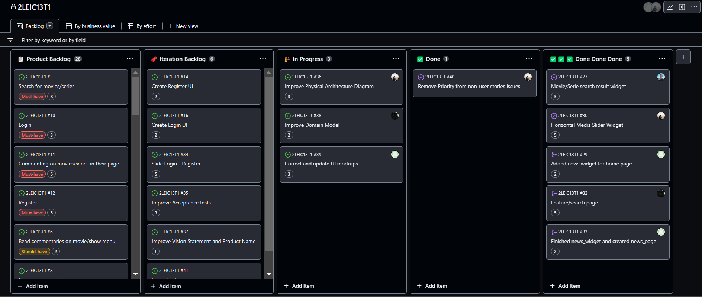

## Project management

All the management of the project is done using this [Github Project board](https://github.com/orgs/FEUP-LEIC-ES-2022-23/projects/21) where all the issues are organized in Product backlog and Iteration backlog.

# Releases
- [v0](Retrospective0.md)
- v1
- v2
- v3
- v4

# Retrospectives
- [Retrospective #0](Retrospective0.md)

# Iteration planning
## Fist Iteration
Begin

Middle

End
