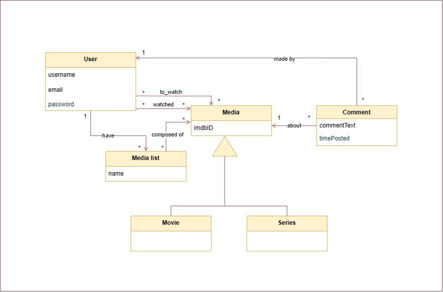

# REQUIREMENTS

## Domain Model

This project consists in an application that provides its users with the possibility of making commentaries on their favorite (or least favorite) movies or series. It also allows users to organize movies or series in lists as they wish. Therefore, we decided to model our application in the following way:

- **User:** this class holds information about a specific user, such as username, profile picture, email, etc.
- **Media:** can be either a movie or a series, and both share some similarities, such as comments and the imdbID.
- **List:** This is defined as a set of media objects that a user can connect and save for his convenience, naming it. Each user will always have 2 special types of lists: want to watch and watched.
- **Comment:** This is a comment on certain media. Can also be about an exact episode of a series instead of the general whole series.

  

  

