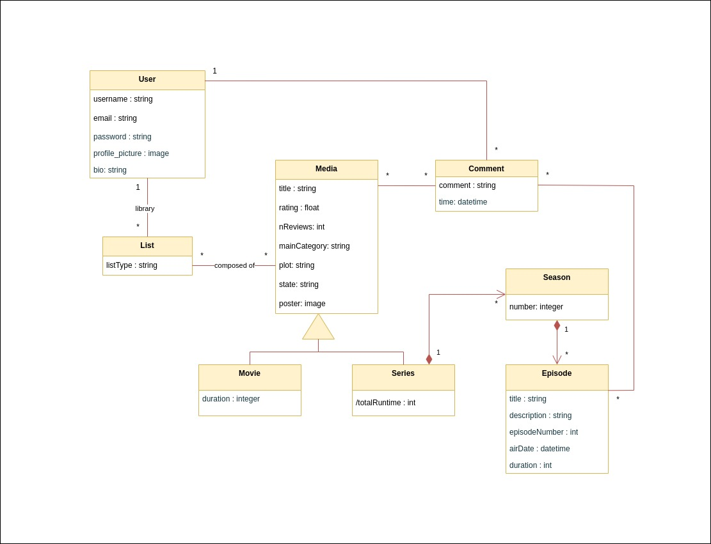

# REQUIREMENTS

## Domain Model

    This project consists in an application that provides its users with the possibility of making commentaries on their favorite (or least favorite) movies or series. It also allows users to organize movies or series in lists as they wish. Therefore, we decided to model our application in the following way:

<ul>
    <li>**User:** this class has some information about a specific user, such as username, profile picture, email, etc.</li>
    <li>**Media:** media can be either a movie or a series, and both share some similar attributes, such as title, rating, main category, plot, etc.</li>
    <li></li>
</ul>

  

  

